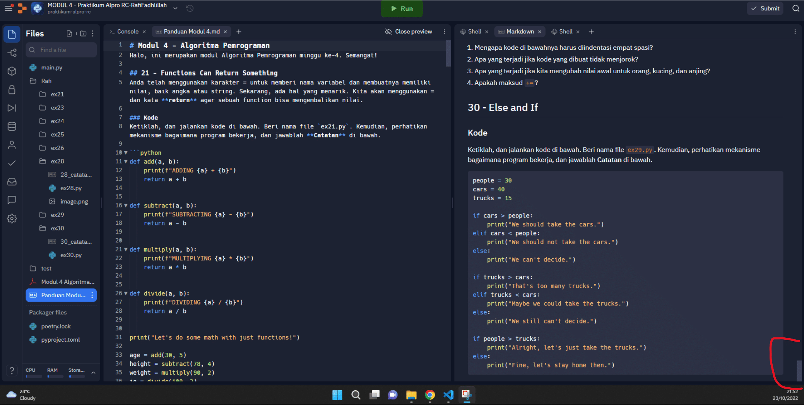

# Soal
Dalam latihan ini, terdapat latihan logika. Pahami, dan tulis apa yang menurut Anda jawabannya, True atau False.

# Jawaban
outputnya adalah sebagai berikut : mohon lihat di file .md nya jangan di lihat di preview. terimakasih bang

 print(True and True)
True
 print(False and True)
False
 print(1 == 1 and 2 == 1)
False
 print("test" == "test")
True
 print(1 == 1 or 2 != 1)
True
 print(True and 1 == 1)
True
 print(False and 0 != 0)
False
 print(True or 1 == 1)
True
 print("test" == "testing")
False
 print(1 != 0 and 2 == 1)
False
 print("test" != "testing")
True
 print("test" == 1)
False
 not(True and False)
True
 not(1 == 1 and 0 != 1)
False
 not(10 == 1 or 1000 == 1000)
False
 not(1 != 10 or  3 == 4)
False
 not("testing" == "testing" and "Zed" == "Cool Guy")
True
 1 == 1 and (not ("testing" == 1 or 1 == 0))
True
 "chunky" == "bacon" and (not (3 == 4 or 3 == 3))
False