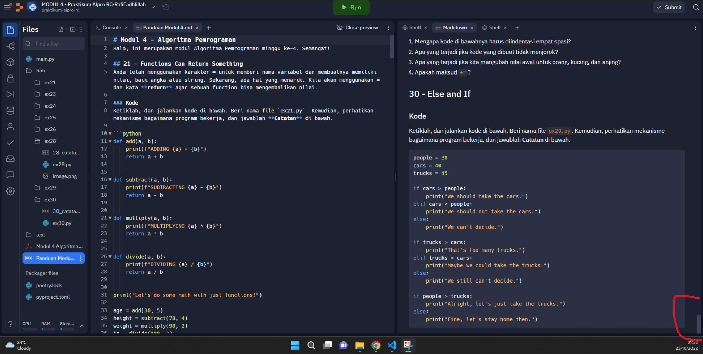

Dalam ex30.py terdapat percabangan if-elif-else

- Pada python ada beberapa statement/kondisi diantaranya adalah if, else dan elif Kondisi if digunakan untuk mengeksekusi kode jika kondisi bernilai benar True. Jika kondisi bernilai salah False maka statement/kondisi if tidak akan di-eksekusi.
- Kondisi if else adalah kondisi dimana jika pernyataan benar True maka kode dalam if akan dieksekusi, tetapi jika bernilai salah False maka akan mengeksekusi kode di dalam else.
- Pengambilan keputusan (kondisi if elif) merupakan lanjutan/percabangan logika dari “kondisi if”. Dengan elif kita bisa membuat kode program yang akan menyeleksi beberapa kemungkinan yang bisa terjadi. Hampir sama dengan kondisi “else”, bedanya kondisi “elif” bisa banyak dan tidak hanya satu.

NB : catatannya tidak ada bang udah di scroll sampe bawah 
terimakasih bang :)  